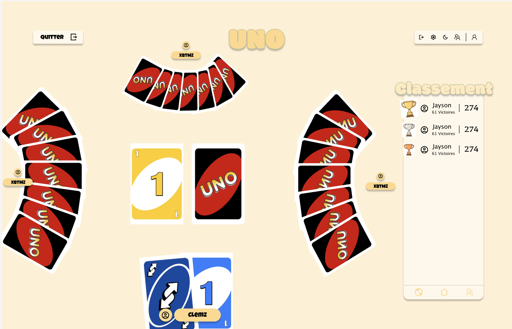
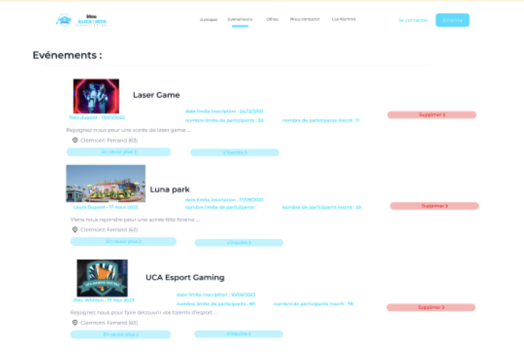
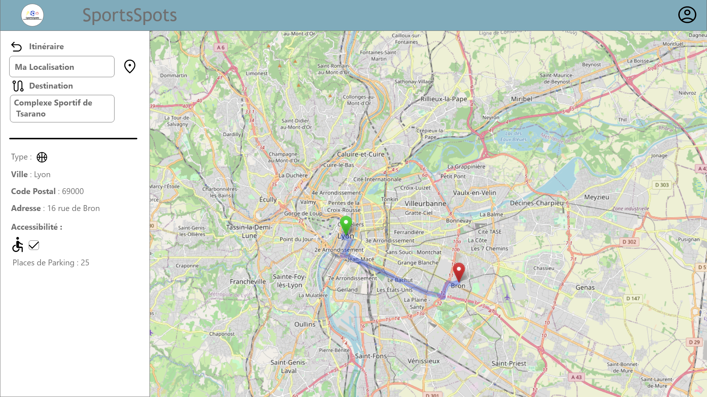

  <h1>Hi 👋, I'm Baptiste Dudonné</h1>
  <h3>Fullstack Developer For CGI. From Normandy, FRANCE.</h3>

  <h4>🚀 Fullstack Developer - Work-study program</h4>

  <h4> 🛠️ Technologies 🛠️ </h4>

  <h4>📱 Frontend 📱</h4>

  
React.js - Angular.js - HTML5, CSS3

  <h4>📱 Backend 📱</h4>

  
Springboot - NestJS - Symfony

   <h4>☁️ Ops ☁️</h4>

   
Gitlab CI/CD - Drone - Docker - Kubernetes - Helm

   <h4>☁️ Messaging ☁️</h4>

   
Kafka - RabbitMQ

   <h1>Projects 🚀</h3>

   <h2>POGOS</h4>
     
🚧 in progress 🚧

   <i>online card game platform</i>
    
Repositories : 

    <a href="https://github.com/pogos-games/pogos-backend" target="_blank">
    Backend <b>NestJS</b>
    </a>
    <a href="https://github.com/pogos-games/pogos-frontend" target="_blank">
    Frontend <b>Angular</b>
    </a>
    
Redis - Mysql DB

  

   <h2>Alica</h4>
   <i>Creation of social network for IUT Clermont Auvergne alumni</i>
    
Repositories : 

    <a href="https://github.com/Baltazouu/ALICA_API" target="_blank">
    Backend <b>Springboot</b>
    </a>
    -
    <a href="https://github.com/Baltazouu/ALICA_WEB" target="_blank">
    Frontend <b>NextJS</b>
    </a>
    -
    <a href="https://github.com/Baltazouu/ALICA_APP" target="_blank">
    Mobile App <b>Android</b>
    </a>
    
Mysql DB

  

   <h2>Sportspots</h2>
   <i>Creation of desktop application to locate sports facilities in your area</i>
    
Repositories : 

    <a href="https://github.com/Baltazouu/Sportspots" target="_blank">
    Desktop App <b>.NET MAUI</b>
    </a>

  

  

 
 

 
   
   
    
   
   
   
   
  </a> 
   
    
    
    

